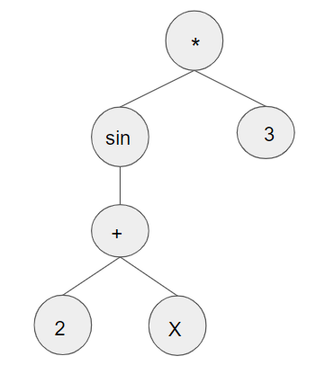

# Function Estimation using Genetic Programming
Implemented an evolutionary algorithm that randomly generates function trees in order to compute complex functions and fit datasets.
#### Population configuration 
- Consisting of a predefined number of chromosomes, randomly generated.
- At each epoch, two parent chromosomes are random selected from the fittest half and after a cross-over operation an offspring is generated. After a mutation over the generated chromosome it replaces the least fit chromosome from the population.

#### Chromosome configuration
- The genotype of each chromosome is represented by a function tree, each node containing one child for unary operators and two children for binary operators and each leaf containing either a constant value, either a variable.
- The fitness of each chromosome is represented by the mean squared error between it's predictions over the dataset and the real values.
- For example, a tree representing f(x)=  sin (2+x) *3  will look like this: 

#### Demo on two sample functions, f(x) = n^3 and f(x) = sin(x) * (x)/2
- [Link to notebook ](functionApproximationDemo.ipynb)

#### Feel free to fork this repository and use it for your data.😀
